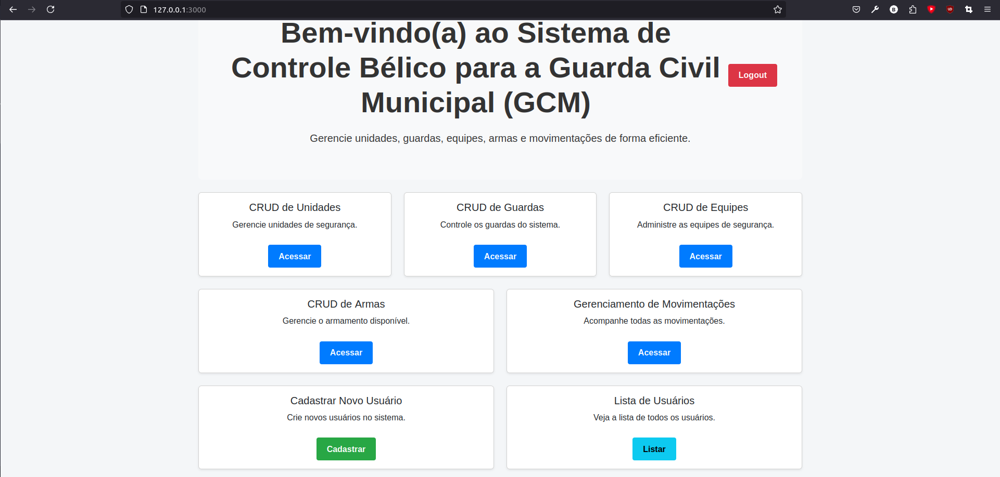
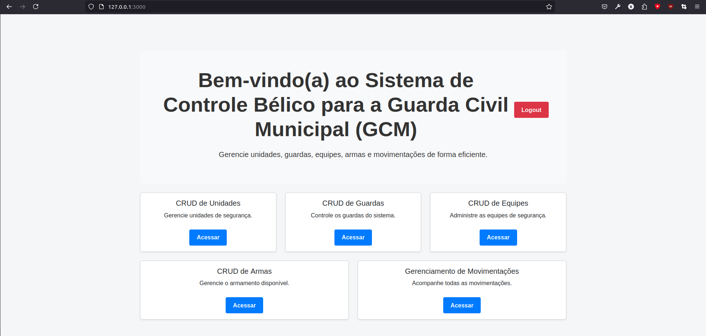
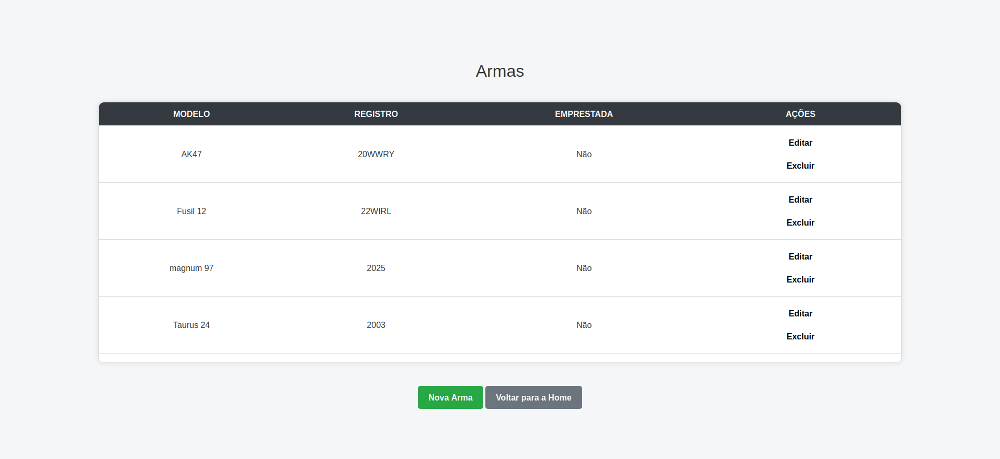
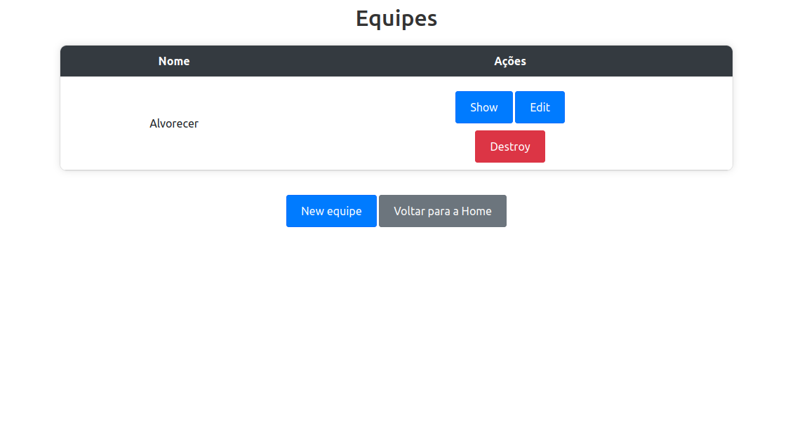
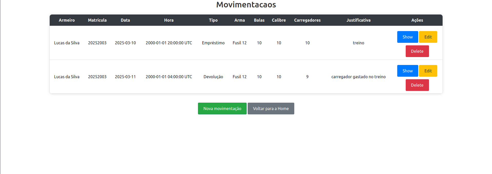
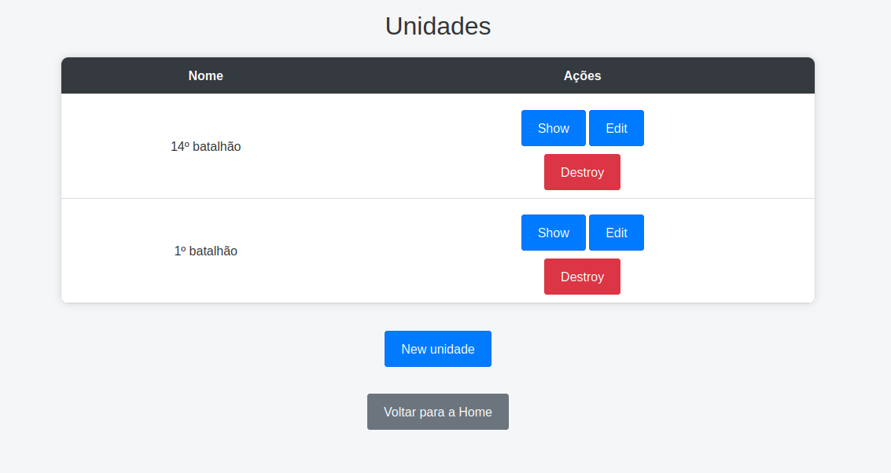
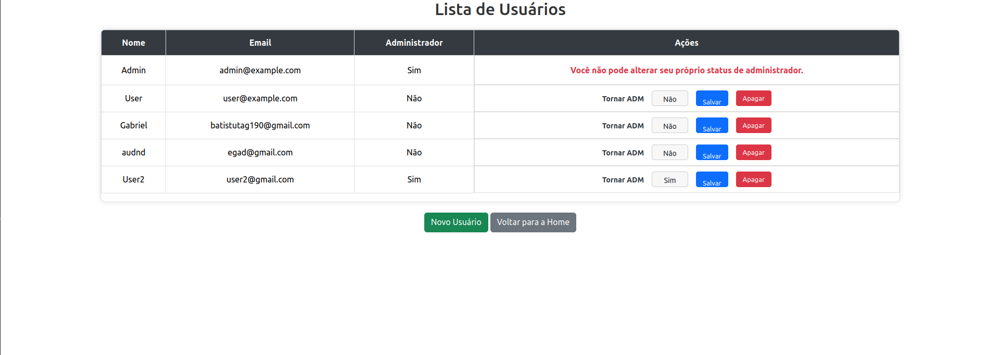

# 🚨 Sistema de Controle Bélico para GCM - Guarda Civil Municipal

[](https://www.ruby-lang.org/)
[](https://rubyonrails.org)
[](https://getbootstrap.com/)

**Sistema especializado para gestão de recursos de segurança pública**  
Controle completo de armamentos, equipes e movimentações estratégicas para órgãos municipais



## ✨ Funcionalidades Destaque
- **Controle Hierárquico**
  - 👑 Acesso Administrativo Completo
  - 👮 Acesso Operacional para Agentes
- **Gestão Centralizada**
  - 🔫 Registro de Armamentos com Histórico
  - 🚔 Cadastro de Unidades e Equipes
  - 📋 Movimentações com Rastreamento
- **Segurança Reforçada**
  - 🔐 Autenticação de Dois Fatores
  - 🔄 Recuperação de Senha via Email

## 🖥 Tecnologias Utilizadas
- **Backend**
  - Ruby 3.4.1
  - Rails 8.0.1
- **Frontend**
  - Bootstrap 5.3.2
  - JavaScript ES6
  - HTML5 + ERB
- **Infra**
  - Rbenv 1.3.2
  - Mailer SMTP
  - Git

## 🚀 Começando

### Pré-requisitos
- Ruby 3.4.1 (`rbenv install 3.4.1`)
- Bundler (`gem install bundler`)

### Instalação
```bash
git clone https://github.com/gabriel-batistuta/prefeitura.git
cd prefeitura
bundle install
rails db:create db:migrate db:seed
rails server
```

## 🔧 Configuração do Mailer
```ruby
# config/environments/[development|production].rb
config.action_mailer.delivery_method = :smtp
config.action_mailer.smtp_settings = {
  address:              'smtp.gmail.com',
  port:                 587,
  domain:               'seu_dominio.com', # ex: google.com
  user_name:            'seu_email@gmail.com', # Adicione seu email
  password:             'sua_senha_app', # Use senha de aplicativo
  authentication:       'plain',
  enable_starttls_auto: true
}
```

## 👥 Usuários de Teste
| Perfil       | Email               | Senha     | Acesso  |
|--------------|---------------------|-----------|---------|
| Administrador| admin@example.com   | password  | 🔑 Full |
| Operacional  | user@example.com    | senha     | 🔒 Base |

**Dica:** Crie seu usuário personalizado:
```ruby
rails console
User.create!(
  name: "Seu Nome",
  email: "seu_email@real.com",
  password: "senha_forte",
  admin: false # Altere para true se necessário
)
```

## 📸 Demonstração Visual

### Painel de Controle
<div style="display: flex; justify-content: center; gap: 10px;">
  
  
</div>

### Módulos Principais
<div style="display: flex; justify-content: center; gap: 10px; margin-top: 10px;">
  
  
</div>
<div style="display: flex; justify-content: center; gap: 10px; margin-top: 10px;">
  
  
</div>

### Controle Administrativo de Usuários
<div style="display: flex; justify-content: center; margin-top: 10px;">
  
</div>


## 📄 Licença
Distribuído sob licença MIT. Veja `LICENSE` para mais informações.

---

**⚠️ Uso Responsável**  
Este sistema destina-se exclusivamente a seleção de estágiarios 2025.1 na DIRETI (Mossoró - RN) 